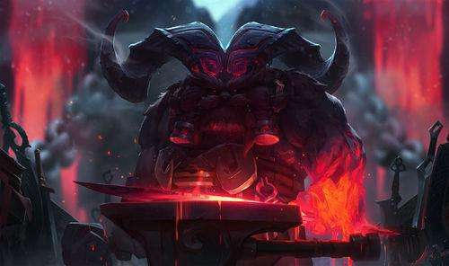

Ornn is the Freljord Crest Freljordian demi-god of forging and craftsmanship. He works in the solitude of a massive smithy, hammered out from the lava caverns beneath the volcano Hearth-Home. There he stokes bubbling cauldrons of molten rock to purify ores and fashion items of unsurpassed quality. When other deities—especially Volibear Volibear—walk the earth and meddle in mortal affairs, Ornn arises to put these impetuous beings back in their place, either with his trusty hammer or the fiery power of the mountains themselves.

🔨
